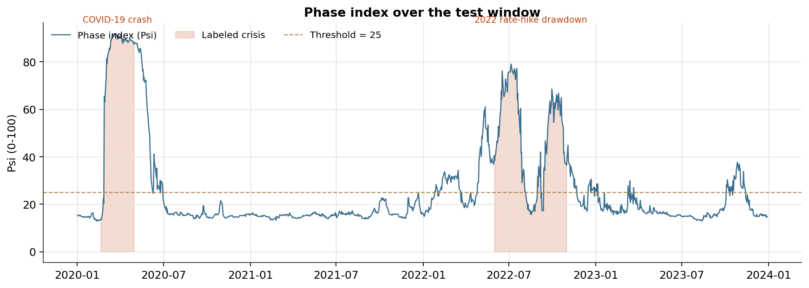
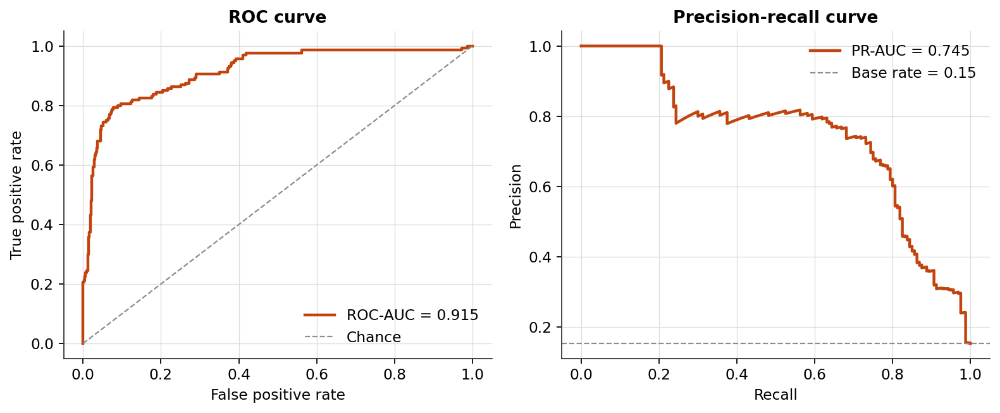
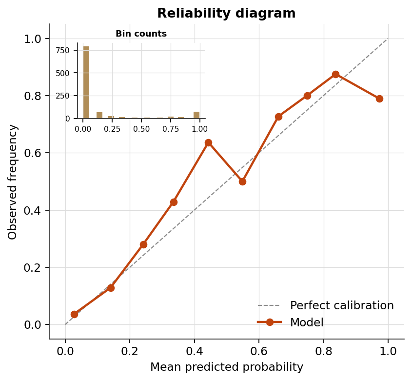

# PhaseIndex — a physics-inspired market crisis detector

[](https://github.com/Ahmed-Hadirassou/PhaseIndexDetector-SingleParticle/actions/workflows/tests.yml)
[](https://www.python.org/)
[](LICENSE)

A market-regime detector that treats each trading day as a particle moving
in a learned, input-conditioned Ginzburg-Landau bistable potential, evolved
by a velocity-Verlet integrator under Langevin thermostatting with a memory
(generalized Langevin / Mori-Zwanzig) term. The model outputs a continuous
phase index **Psi** in `[0, 1]`: how far the market has moved from a
"stable" basin toward a "crisis" basin. Per-day friction (`gamma`),
temperature (`T`), and dissipation (`alpha`) are predicted by a small
encoder network rather than fixed constants.

This version (**V30.4**) adds Gaussian-smoothed soft training labels and
Stochastic Weight Averaging on top of the V30.3 architecture. See the
module docstring in `main_v304_soft_labels.py` for the full changelog and
methodology notes.

*Why "SingleParticle"?* This detector represents the whole market as one
particle in one potential well. A multi-particle, GNN-coupled formulation
(one particle per sector) was built and evaluated in an earlier lineage of
this project and set aside — it scored lower (AUC 0.83) than the current
single-particle design and, in the version that unrolled the dynamics from
a fixed initial condition, the physics was diagnosably inactive (zero force
at the origin, reducing the model to a plain MLP). Naming this repo
explicitly keeps the two designs from being conflated.

## Repository layout

| File | Role |
|---|---|
| `main_v304_soft_labels.py` | Model, training loop, data pipeline, entry point (`python main_v304_soft_labels.py`) |
| `walk_forward.py` | Expanding-window validation across 6 independent historical crises (2007-2023) — see *Walk-forward validation* below; the primary evidence for this repo's numbers, not the single-window report |
| `features.py` | 200 features across 5 classes: statistical, volatility, momentum, market, macro |
| `velocity_features.py` | 4 features: first/second differences of realized volatility |
| `spectral_features.py` | 40 wavelet-decomposition features, wireable via `CFG.INCLUDE_SPECTRAL_FEATURES` (off by default — see *Explored and rejected*) |
| `config.py` | Ticker universe and shared constants read by `features.py` |
| `evaluation_metrics.py` | Statistical indicators beyond the base report: MCC, balanced accuracy, Brier Skill Score, calibration slope/intercept, block-bootstrap confidence intervals, Kramers-rate diagnostic, run-history comparison |
| `visualization.py` | Report figures: ROC/PR curves, reliability diagram, confusion matrices, Psi time series, threshold sweep, physics correlations, bootstrap distributions, training curves |
| `tests/` | pytest suite (55 tests) — labels, loss, physics steps, causality of every learned time-window, report arithmetic, statistics, every plot function |

## Running it

```bash
pip install -r requirements.txt
python main_v304_soft_labels.py        # single-window report, ~10 min
python walk_forward.py                 # 6-fold validation, ~35-45 min — see below
```

`main_v304_soft_labels.py` downloads the ticker universe via `yfinance`,
builds the feature set, trains a 5-seed ensemble, calibrates it two ways
(see *Calibration* below), and writes a console report plus
`results/figures/*.png` and `results/run_history.json`.

Both scripts print a configuration banner at startup listing every
experimental flag's current value — check it before trusting a run's
numbers; several flags below default to off for good, measured reasons.

## Results

**Read the walk-forward numbers first.** The single test window below
(2020 onward) contains only 2 largely independent crisis episodes, which
puts a hard floor on precision no amount of modeling fixes — the
block-bootstrap CI on PR-AUC spans roughly [0.45, 0.94]. The walk-forward
run is the same model, same code, evaluated on 6 independent historical
windows instead, and is the number to cite.

### Walk-forward validation (recommended)

`python walk_forward.py`, expanding-window, 5-seed ensemble per fold, all
experimental flags off:

| Fold | Test window | Crisis | ROC-AUC | PR-AUC | Cohen's d | Recall | Precision |
|---|---|---|---|---|---|---|---|
| 1 | 2007-2009 | Subprime onset + GFC | 0.8199 | 0.7124 | 1.36 | 0.981 | 0.354 |
| 2 | 2011-2012 | US downgrade / EU debt | 0.9854 | 0.9531 | 4.11 | 0.924 | 0.824 |
| 3 | 2015-2016 | August 2015 selloff | 0.8522 | 0.6899 | 1.77 | 0.674 | 0.244 |
| 4 | 2018-2019 | Q4 2018 selloff | 0.8238 | 0.3915 | 1.43 | 0.818 | 0.331 |
| 5 | 2020-2021 | COVID-19 crash | 0.9477 | 0.8852 | 3.37 | 0.902 | 0.630 |
| 6 | 2022-2023 | Rate-hike drawdown | 0.8666 | 0.7772 | 1.70 | 0.679 | 0.698 |

**Mean ROC-AUC: 0.883 ± 0.062** (range 0.82-0.99) · **Mean PR-AUC: 0.735 ± 0.179**
(range 0.39-0.95) · **Mean Cohen's d: 2.29 ± 0.98**, across 6 independent
historical crises rather than 2 resamples of one window.

The pattern worth stating plainly, not averaging away: **ROC-AUC ≥0.94 on
every panic-driven crash (GFC, COVID) vs. 0.82-0.87 on every slow,
credit/rate-driven grind (2015, 2018, 2022)** — reproducible across every
variant tried (see *Explored and rejected*), so it is a property of this
architecture on this data, not noise from one run. Fold 4 (Q4 2018) is the
weakest window on every metric and is a genuine, unresolved open problem,
not yet a solved one.

Calibration in this harness uses an in-sample tail (last ~2 years of each
fold's training window) rather than the held-out proxy scheme below —
identical protocol across every fold and variant, so absolute calibrated
recall/precision here run slightly optimistic, but comparisons *between*
variants are apples-to-apples.

### Single test window (2020 onward)

Kept for continuity with earlier reports; treat the walk-forward numbers
above as authoritative. From a real 5-seed run:

| Metric | Base (Psi ≥ 0.65) | Calibrated (tau* = 0.25) |
|---|---|---|
| Accuracy | 90.20% | 91.35% |
| Recall | 45.62% | 74.37% |
| Precision | 80.22% | 70.83% |
| F1 | 58.17% | 72.56% |
| FPR | 2.04% | 5.90% |

| Invariant | Value |
|---|---|
| ROC-AUC | 0.9138 |
| PR-AUC | 0.7429 |
| Cohen's d | 1.93 |
| MCC | 0.675 |

Block-bootstrap 95% CI: ROC-AUC [0.823, 0.981], PR-AUC [0.428, 0.934] — see
*Calibration and statistical rigor* for why this interval, not the point
estimate, is the honest summary of a 2-crisis test window.

By named crisis: COVID-19 recall 90.2% (calibrated) vs. 2022 rate-hike
drawdown 67.0% — the same panic-vs-grind asymmetry the walk-forward
confirms independently above.

### An independent physics-derived signal: the Kramers rate

Kramers escape-rate theory gives an analytic transition-rate proxy from
the model's own learned potential shape and thermostat parameters:
`rate ~ exp(-delta_V / T) / gamma`, where `delta_V = b^2/(4a)` is the
barrier height between the stable and crisis wells. This is never used in
training or fed into Psi — it is computed once, after the fact, purely
from parameters the model already produces (see
`evaluation_metrics.kramers_rate_proxy`).

Reproduced across multiple independent runs: standalone ROC-AUC **0.86-0.89**
(after correcting a sign inversion — low proxy value corresponds to high
crisis likelihood, not high), with correlation to Psi of only **-0.15 to
-0.22** — informative on its own, and not simply a restatement of what Psi
already says. A direct logistic-regression blend of Psi and this signal,
fit strictly on the calibration set, did not improve on Psi alone in
testing (see below) — the calibration window's single crisis episode
appears too thin to fit the blend weights reliably — but the standalone
signal itself is a genuine, reproducible finding worth reporting on its
own terms.

**Calibration**

Two temperatures are fit and reported side by side; see *Calibration and
statistical rigor* for what each means and why both are shown. A third,
3-parameter beta calibration (`CFG.BETA_CALIBRATION`) is available for
runs where the standard temperature scalar under-corrects an asymmetric
miscalibration.

| | ECE | Brier | Log-loss | Calib. slope (1.0 = ideal) |
|---|---|---|---|---|
| In-sample T_calib | 3.06% | 0.0689 | 0.2606 | 0.718 |
| Proxy (out-of-sample) T_calib | 2.95-3.4% | ~0.068 | ~0.256 | 0.80-0.87 |

Which of the two calibrations wins is itself not stable across runs — both
are reported for exactly this reason; do not treat either as definitively
"the" calibration.

**Adding figures to this section**

```bash
python main_v304_soft_labels.py   # writes results/figures/*.png
git add results/
git commit -m "Add example run output"
git push
```

then embed the most informative ones here, for example:

```markdown



```

## Explored and rejected

Four architecture/loss extensions were implemented, tested end to end
(unit tests plus a full walk-forward comparison, not a single-window
run), and set aside as not delivering a net improvement. Reported here
because a negative result obtained this carefully is itself evidence
about where this architecture's ceiling is, not something to bury.

| Extension | Idea | Walk-forward verdict |
|---|---|---|
| `FDT2_COLORED_NOISE` | The Langevin memory term dissipates via `phi*s` but only fluctuates via white noise tuned to `gamma` — a real violation of the fluctuation-dissipation theorem of the second kind. Adds matched Ornstein-Uhlenbeck colored noise. | Theoretically correct fix (verified by an equipartition test on the model's own dynamics), but net neutral-to-slightly-negative on detection across folds (mean ROC-AUC 0.883 vs. 0.877 unpaired noise level). Kept in the code, off by default. |
| `TCN_VELOCITY_ENCODER` | A small causal 1D-conv stack giving `FastEncoder` a 5-day window of raw features instead of only the current day. | Clear regression: physics correlations partially inverted (`corr(gamma, Psi)` flipped sign), Cohen's d dropped to the session's lowest. Extra representational flexibility upstream of the physics bottleneck destabilized it, not enriched it. |
| `MACRO_SKIP_CONNECTION` | A dedicated small sub-network giving the potential direct access to credit-spread and yield-curve levels, bypassing the shared 80-feature bottleneck. | Same failure mode as the TCN, more severe: `corr(T, Psi)` collapsed from ~+0.63 to +0.18. |
| `DYNAMIC_K_FN` | The training loss's false-negative penalty ceiling modulated by an *exogenous* persistence signal (weeks of sustained credit-spread widening, computed only from past prices, never from labels or model outputs) — designed specifically to target the slow-grind weakness above. | On the two folds it targets (2018, 2022), it is the worst of all four variants tested on PR-AUC. An apparent large win on fold 1 does not survive scrutiny: that fold is the shortest training window and longest test window of the six, and moved similarly under the *unrelated* FDT-2 change too — a fold-fragility artifact, not a targeted effect. |

The common thread across the first three: any change that gives the
network a more flexible path to the same physical parameters —
temporally, spatially, or architecturally — measurably destabilizes the
learned physics rather than enriching it, consistent with this project's
own earlier history (a GNN-coupled multi-particle lineage and a
~229k-parameter transformer lineage were both tried before this
single-particle design and both abandoned for the same reason).

## Calibration and statistical rigor

Four things worth understanding before citing numbers from this repo,
all documented in more detail in code where they occur:

1. **Why two calibrations are reported.** The calibration window
   (2017-2019) is a subset of the training window (`CFG.
   STRICT_CALIBRATION_HOLDOUT = False` by default), so a temperature
   fit directly on it (`T_calib`, "in-sample") is fit on model outputs
   the model has already trained on. Excluding that window from training
   instead (`True`) was tried and rejected as the default: it removes
   the `2018-10-01..12-31` crisis from training entirely (the model's
   only training-set example of a slow, rate-driven drawdown), which
   measurably hurt 2022-crisis recall and every other detection metric.

   `CFG.PROXY_CALIBRATION = True` (default) instead trains a second,
   disposable ensemble on data strictly before 2017 and fits a
   temperature from *that* ensemble's genuinely out-of-sample output on
   the calibration window — costs ~2 extra minutes of training, touches
   nothing the final model learns from. Which calibration wins is not
   stable run to run; both are reported for exactly this reason.

2. **`spectral_features.py` and the four extensions above are wireable
   but off by default.** Each is a real, tested, backward-compatible
   opt-in (`CFG.INCLUDE_SPECTRAL_FEATURES`, `CFG.FDT2_COLORED_NOISE`,
   etc.) — flipping one on reproduces the exact numbers in *Explored and
   rejected* above, not new behavior.

3. **The single test window holds only 2 largely independent crisis
   episodes.** The walk-forward run above exists specifically to address
   this — treat its 6-fold spread, not the single-window bootstrap CI,
   as the primary uncertainty estimate for this model.

4. **Fold 4 (Q4 2018) is a genuine, unresolved weak point**, not a solved
   one — the lowest PR-AUC of all six folds, in every variant tested. It
   is the most promising remaining direction for anyone extending this
   work, more so than another architecture change to the folds that
   already perform well.

If any number from this repo appears in a public place (a repo
description, a social card, a paper abstract), keep it in sync with
whatever a current run of `walk_forward.py` actually produces.

## Tests

```bash
pytest
```

55 tests, run on every push via GitHub Actions (badge above). Every test
operates on synthetic or hand-picked inputs — the suite never calls
`yfinance.download()` or trains a real model on real data, so it stays
fast, free, and independent of Yahoo Finance's rate limits. Notably
includes direct causality checks (no future-day leakage) for both the
TCN's learned time window and the exogenous persistence signal. A full
download-and-train run is a separate, manual step
(`python main_v304_soft_labels.py` or `python walk_forward.py`), not
something CI does on every push.

## License

MIT (see `LICENSE`). If GitHub's license badge above isn't rendering,
check that the file contains an unmodified standard MIT template — GitHub
detects license type by matching file content, and a hand-edited file can
fail that match even though it's still legally a valid license.
