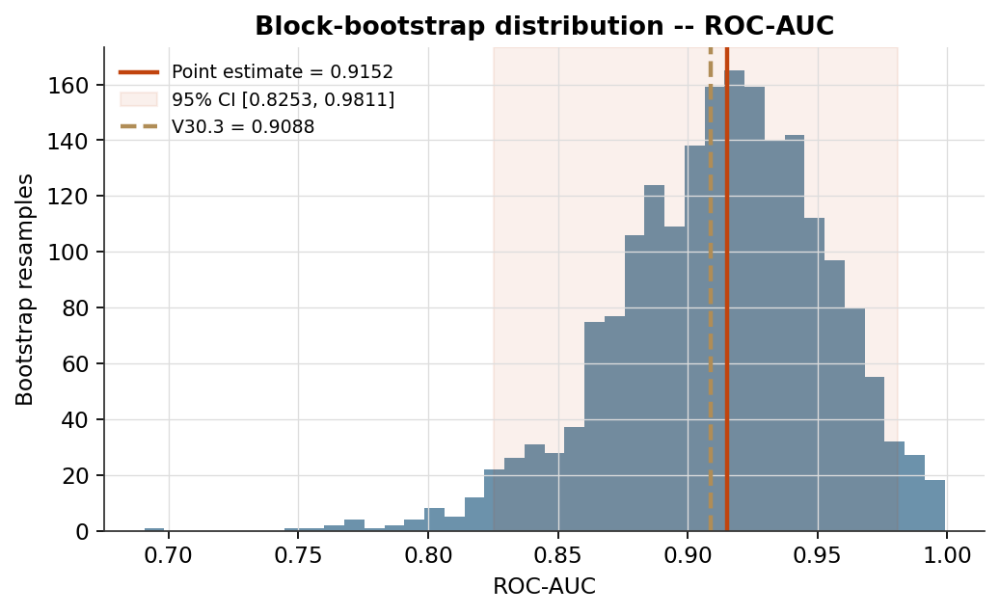

# PhaseIndex — a physics-inspired market crisis detector

[](https://github.com/Ahmed-Hadirassou/PhaseIndexDetector-SingleParticle/actions/workflows/tests.yml)
[](https://www.python.org/)
[](LICENSE)

A market-regime detector that treats each trading day as a particle moving
in a learned, input-conditioned Ginzburg-Landau bistable potential, evolved
by a velocity-Verlet integrator under Langevin thermostatting with a memory
(generalized Langevin / Mori-Zwanzig) term. The model outputs a continuous
phase index **Psi** in `[0, 1]`: how far the market has moved from a
"stable" basin toward a "crisis" basin. Per-day friction (`gamma`),
temperature (`T`), and dissipation (`alpha`) are predicted by a small
encoder network rather than fixed constants.

This version (**V30.4**) adds Gaussian-smoothed soft training labels and
Stochastic Weight Averaging on top of the V30.3 architecture. See the
module docstring in `main_v304_soft_labels.py` for the full changelog and
methodology notes.

*Why "SingleParticle"?* This detector represents the whole market as one
particle in one potential well. A multi-particle formulation (one particle
per sector, coupled) is a separate, heavier architecture — naming this
repo explicitly keeps the two from being conflated.

## Repository layout

| File | Role |
|---|---|
| `main_v304_soft_labels.py` | Model, training loop, data pipeline, entry point (`python main_v304_soft_labels.py`) |
| `features.py` | 200 features across 5 classes: statistical, volatility, momentum, market, macro |
| `velocity_features.py` | 4 features: first/second differences of realized volatility |
| `spectral_features.py` | 40 wavelet-decomposition features (**not currently wired into the pipeline** — see note below) |
| `config.py` | Ticker universe and shared constants read by `features.py` |
| `evaluation_metrics.py` | Statistical indicators beyond the base report: MCC, balanced accuracy, Brier Skill Score, calibration slope/intercept, block-bootstrap confidence intervals, run-history comparison |
| `visualization.py` | Report figures: ROC/PR curves, reliability diagram, confusion matrices, Psi time series, threshold sweep, physics correlations, bootstrap distributions, training curves |
| `tests/` | pytest suite — labels, loss, one physics step, report arithmetic, statistics, every plot function |

## Running it

```bash
pip install -r requirements.txt
python main_v304_soft_labels.py
```

Downloads the ticker universe via `yfinance`, builds the feature set,
trains a 3-seed ensemble, runs calibration, and writes:

- A console report (detection metrics, calibration, invariants, named
  crises in the test window, threshold sweep, physics correlations,
  bootstrap confidence intervals, version-over-version comparison)
- `results/figures/*.png` — the figures listed above
- `results/run_history.json` — every run's headline metrics, keyed by
  version, so the next version compares against this one automatically

## Results

Not embedded directly in this README on purpose: a placeholder figure here
made from synthetic data could get mistaken for a real finding by someone
skimming the repo, which is worse than showing nothing. Once you've run
the command above once:

```bash
git add results/
git commit -m "Add example run output"
git push
```

then embed the two or three most informative figures here, for example:

```markdown



```

## Tests

```bash
pytest
```

Runs on every push via GitHub Actions (badge above). Every test operates
on synthetic or hand-picked inputs — the suite never calls
`yfinance.download()` or trains a real model, so it stays fast, free, and
independent of Yahoo Finance's rate limits. A full download-and-train run
is a separate, manual step (`python main_v304_soft_labels.py`), not
something CI should do on every push.

## Before publishing numbers from this repo

Two things worth resolving first, both documented in code where they occur:

1. **Calibration/train overlap.** The default split fits temperature
   scaling on a calibration window that is a *subset* of the training
   window (see `split_data()`). This does not affect the headline
   detection metrics (recall, precision, F1, ROC-AUC, PR-AUC — all
   computed on a genuinely held-out test set), but it can optimistically
   bias the calibration numbers (ECE, Brier, log-loss). Set
   `CFG.STRICT_CALIBRATION_HOLDOUT = True` for a fully disjoint 3-way
   split before quoting those three numbers specifically.
2. **`spectral_features.py` is not imported by the pipeline.** The
   feature-partition indices (`SLOW_IDX` / `FAST_IDX`) are sized for the
   204-column set without it. Confirm this exclusion is intentional.

If any number from this repo appears in a public place (a repo
description, a social card, a paper abstract) before point 1 above is
resolved, qualify it there too — a caveat that only lives in this file is
easy for a reader to miss if they saw the number somewhere else first.

## License

MIT (see `LICENSE`). If GitHub's license badge above isn't rendering,
check that the file contains an unmodified standard MIT template — GitHub
detects license type by matching file content, and a hand-edited file can
fail that match even though it's still legally a valid license.

